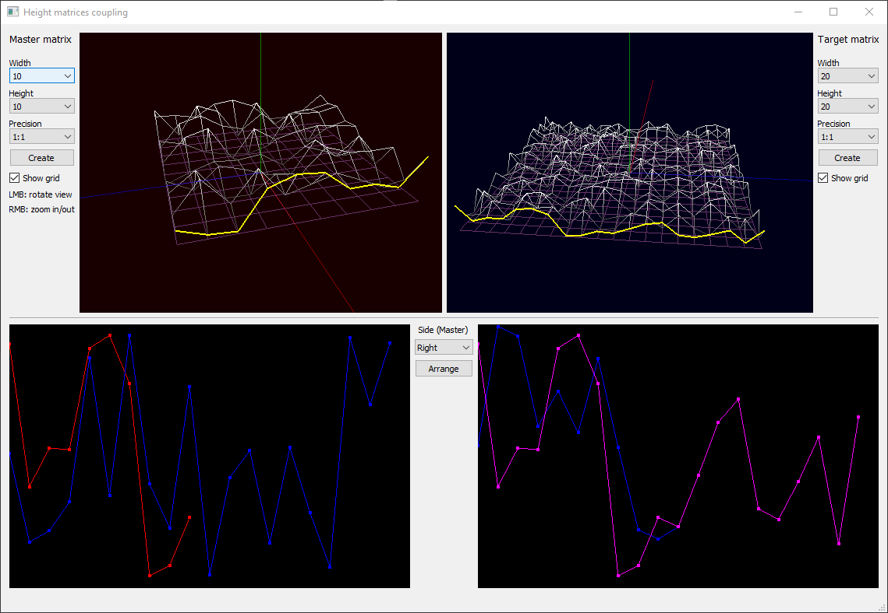

# Height matrices coupling app
Application was developed using Qt 5 and OpenGL as one of the test assignments I've done in 2019.
The main purpose is to arrange two matrices (so-called "master" and "target") by a chosen side. Matrices are generated randomly with a given dimensions and precision. In order to arrange target matrix it should be no less precise than the master matrix.
Upper side of the GUI represents views of generated matrices and their control elements. In the bottom-left corner there is a profile viewer that shows closeup view of both matrices arrangement sides. The bottom-right shows both original and arranged profiles of the target matrix.

